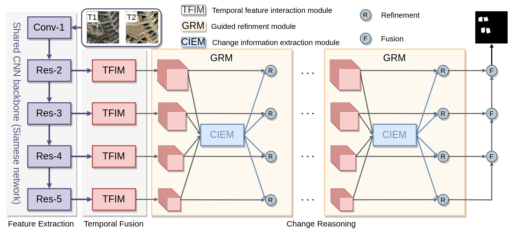

# Remote Sensing Change Detection via Temporal Feature Interaction and Guided Refinement
### Zhenglai Li, Chang Tang, Lizhe Wang, Albert Zomaya

## Abstract
Remote sensing change detection (RSCD), which identifies the changed and unchanged pixels from a registered pair of remote sensing images, has enjoyed remarkable success recently. However, locating changed objects with fine structural details is still a challenging problem in RSCD. In this paper, we propose a novel remote sensing change detection network via temporal feature interaction and guided refinement (TFI-GR) to solve this issue. Specifically, unlike previous methods, which just employ one single concatenation or subtraction operation for bi-temporal feature fusion, we design a temporal feature interaction module (TFIM) to enhance interaction between bi-temporal features and capture temporal difference information at diverse feature levels. Afterword, a guided refinement modules (GRM), which aggregates both low- and high-level temporal difference representations to polish the location information of high-level features and filter the background clutters of low-level features, is repeatedly performed. Finally, the multi-level temporal difference features are progressively fused to generate change maps for change detection. To demonstrate the effectiveness of the proposed TFI-GR, comprehensive experiments are performed on three high spatial resolution remote sensing change detection datasets. Experimental results indicate that the proposed method is superior to other state-of-the-art change detection methods.



This figure shows the workflow of our method.

## Get Start
**1. Download Datasets**

- [LEVIR](https://justchenhao.github.io/LEVIR/) 

- [BCDD](https://study.rsgis.whu.edu.cn/pages/download/building_dataset.html)

- [SYSU](https://github.com/liumency/SYSU-CD)

- [CDD](https://drive.google.com/file/d/1GX656JqqOyBi_Ef0w65kDGVto-nHrNs9/edit)

Prepare datasets into following structure,
```
├─Train
    ├─A
    ├─B
    ├─label
    └─list
├─Val
    ├─A
    ├─B
    ├─label
    └─list
├─Test
    ├─A
    ├─B
    ├─label
    └─list
```

**2. Train**
```
sh ./tools/train.sh
```

**3. Test**

[Pretrained Models](https://drive.google.com/file/d/1cuZUbZIKYem67DAzJtLaHVrLxO3Nl1my/view?usp=sharing)

```
sh ./tools/test.sh
```

### Acknowlogdement

This repository is built under the help of the projects [BIT_CD](https://github.com/justchenhao/BIT_CD), 
[CDLab](https://github.com/Bobholamovic/CDLab), and [MobileSal](https://github.com/yuhuan-wu/MobileSal) for academic use only.

## Citation
```
@article{li2022cd,
  author={Li, Zhenglai and Tang, Chang and Wang, Lizhe and Zomaya, Albert Y.},
  journal={IEEE Transactions on Geoscience and Remote Sensing}, 
  title={Remote Sensing Change Detection via Temporal Feature Interaction and Guided Refinement}, 
  year={2022},
  volume={60},
  number={},
  pages={1-11},
  doi={10.1109/TGRS.2022.3199502}
}
```

